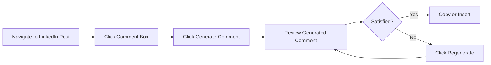
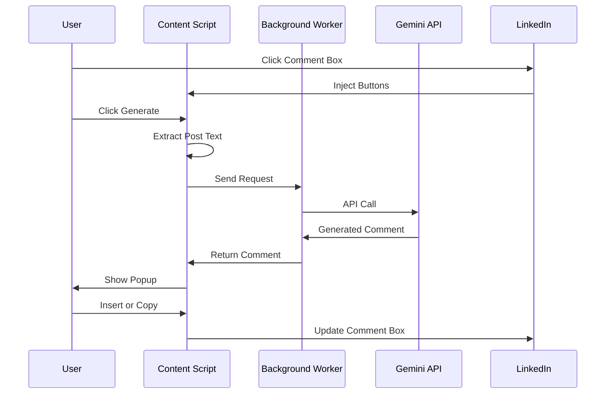

<div align="center">

# 🚀 LinkedIn Gemini Commenter

### AI-Powered LinkedIn Comment Generator

[](https://github.com)
[](https://developer.chrome.com/docs/extensions/mv3/)
[](https://ai.google.dev/)
[](https://opensource.org/licenses/MIT)

**Generate professional, engaging LinkedIn comments in seconds using Google's Gemini AI**

[Features](#-features) • [Installation](#-installation) • [Usage](#-usage) • [Screenshots](#-screenshots) • [FAQ](#-faq)

</div>

---

## 📋 Table of Contents

- [✨ Features](#-features)
- [🎯 Why Use This Extension?](#-why-use-this-extension)
- [📦 Installation](#-installation)
- [🔑 Getting Your Gemini API Key](#-getting-your-gemini-api-key)
- [🎮 Usage](#-usage)
- [🏗️ Architecture](#️-architecture)
- [🛠️ Technical Stack](#️-technical-stack)
- [🔒 Privacy & Security](#-privacy--security)
- [❓ FAQ](#-faq)
- [🐛 Troubleshooting](#-troubleshooting)
- [🤝 Contributing](#-contributing)
- [📄 License](#-license)

---

## ✨ Features

<table>
<tr>
<td width="50%">

### 🤖 AI-Powered Generation
- Uses Google Gemini 2.5 Flash model
- Generates professional, context-aware comments
- Natural language that sounds human
- Adapts tone to post content

</td>
<td width="50%">

### 🎨 Beautiful UI
- Clean, modern popup interface
- Smooth animations and transitions
- Non-intrusive button placement
- Mobile-responsive design

</td>
</tr>
<tr>
<td width="50%">

### ⚡ Smart Features
- **Generate**: Create fresh comments
- **Regenerate**: Get alternative versions
- **Copy**: One-click clipboard copy
- **Insert**: Directly paste into LinkedIn

</td>
<td width="50%">

### 🔐 Privacy First
- API key stored locally only
- No data sent to external servers
- No tracking or analytics
- Open source and auditable

</td>
</tr>
</table>

---

## 🎯 Why Use This Extension?

<div align="center">

| Problem | Solution |
|---------|----------|
| 😰 **Writer's Block** | AI generates thoughtful comments instantly |
| ⏰ **Time-Consuming** | Reduce commenting time from minutes to seconds |
| 📝 **Generic Responses** | Get context-aware, personalized comments |
| 🔄 **Need Variations** | Regenerate for different approaches |
| 💼 **Professional Tone** | Always maintain a professional voice |

</div>

---

## 📦 Installation

### Method 1: Load Unpacked (Developer Mode)

```bash
# Step 1: Download the extension
git clone https://github.com/yourusername/linkedin-gemini-commenter.git
# or download and extract the ZIP file
```

**Step 2: Load in Chrome**

1. Open Chrome and navigate to `chrome://extensions/`
2. Enable **Developer mode** (toggle in top-right corner)
3. Click **"Load unpacked"**
4. Select the `linkedin-gemini-commenter` folder
5. Done! 🎉

<details>
<summary>📹 <b>Show me with screenshots</b></summary>


</details>

### Method 2: Install from ZIP

1. Download `linkedin-gemini-commenter.zip`
2. Extract the ZIP file
3. Follow steps 2-5 from Method 1

---

## 🔑 Getting Your Gemini API Key

### Quick Start (2 minutes)

1. **Visit Google AI Studio**
   ```
   🔗 https://makersuite.google.com/app/apikey
   ```

2. **Sign in with your Google account**

3. **Click "Create API Key"**

4. **Copy your API key** (starts with `AIzaSy...`)

5. **Paste it in the extension popup**

<details>
<summary>🎥 <b>Detailed walkthrough with images</b></summary>

### Step-by-Step Guide

**Step 1:** Visit Google AI Studio
- Go to [makersuite.google.com/app/apikey](https://makersuite.google.com/app/apikey)
- Sign in with your Google account

**Step 2:** Create API Key
- Click the blue **"Create API Key"** button
- Select an existing project or create a new one
- Your API key will be generated instantly

**Step 3:** Copy the Key
- Click the **copy icon** next to your key
- Keep it safe! You can always come back to view it

**Step 4:** Add to Extension
- Click the extension icon in Chrome toolbar
- Paste your API key in the input field
- Click **"Save API Key"**

✅ **Success!** You're ready to generate comments!

</details>

### 💡 API Key Tips

- ✅ **Free Tier Available**: Gemini offers generous free usage
- 🔒 **Keep it Secret**: Never share your API key
- 📊 **Monitor Usage**: Check Google AI Studio for usage stats
- 🔄 **Regenerate if Leaked**: Create a new key if compromised

---

## 🎮 Usage

### Basic Workflow



### Step-by-Step Guide

#### 1️⃣ **Navigate to LinkedIn**
Open any LinkedIn post in your feed

#### 2️⃣ **Click Comment Box**
Click on the comment input area

#### 3️⃣ **Generate Comment**
Two buttons will appear:
- 🟢 **Generate Comment** - Create new comment
- 🔄 **Regenerate** - Create alternative version

#### 4️⃣ **Review in Popup**
A beautiful popup appears with your generated comment

#### 5️⃣ **Take Action**
Choose one:
- 📋 **Copy** - Copy to clipboard
- ✏️ **Insert to Comment** - Paste directly into LinkedIn
- ❌ **Close** - Dismiss and try again

### 🎨 Interface Preview

```
┌─────────────────────────────────────┐
│  Generated Comment            [×]   │
├─────────────────────────────────────┤
│                                     │
│  This is a great insight! Your      │
│  perspective on AI ethics really    │
│  resonates with the current         │
│  industry challenges.               │
│                                     │
├─────────────────────────────────────┤
│  [📋 Copy]  [✏️ Insert to Comment] │
└─────────────────────────────────────┘
```

## 🏗️ Architecture

### File Structure

```
linkedin-gemini-commenter/
├── 📄 manifest.json          # Extension configuration (Manifest V3)
├── 🔧 background.js          # Service worker - API communication
├── 💉 content.js             # LinkedIn page interaction
├── 🖼️ icon.png              # Extension icon
├── 📁 popup/
│   ├── popup.html           # Settings interface
│   ├── popup.js             # Settings logic
│   └── popup.css            # Settings styling
└── 📁 styles/
    └── inject.css           # Injected button & popup styles
```

### Data Flow



---

## 🛠️ Technical Stack

### Core Technologies

| Technology | Purpose | Version |
|------------|---------|---------|
|  | Platform | Manifest V3 |
|  | Language | ES6+ |
|  | AI Model | 2.5 Flash |
|  | Structure | 5 |
|  | Styling | 3 |

### Key APIs Used

- **Chrome Storage API** - Secure local storage
- **Chrome Runtime API** - Message passing
- **Gemini REST API** - AI generation
- **Clipboard API** - Copy functionality
- **MutationObserver API** - DOM monitoring

### Browser Compatibility

| Browser | Support | Notes |
|---------|---------|-------|
|  | ✅ Full | Recommended |
|  | ✅ Full | Chromium-based |
|  | ✅ Full | Chromium-based |
|  | ❌ Not Yet | Manifest V3 differences |
|  | ❌ Not Yet | Different extension format |

---

## 🔒 Privacy & Security

### Our Privacy Commitments

<table>
<tr>
<td width="33%" align="center">

### 🏠 Local Storage
**API keys never leave your device**

Stored using Chrome's secure local storage API

</td>
<td width="33%" align="center">

### 🚫 No Tracking
**Zero analytics or telemetry**

We don't collect any usage data

</td>
<td width="33%" align="center">

### 👁️ Open Source
**Fully auditable code**

Review every line on GitHub

</td>
</tr>
</table>

### What Data is Sent?

| Data | Sent To | Purpose |
|------|---------|---------|
| Post Text | Google Gemini API | Generate relevant comment |
| API Key | Google Gemini API | Authenticate request |
| Nothing else | - | - |

### Security Best Practices

✅ **DO:**
- Keep your API key private
- Regenerate key if exposed
- Review generated comments before posting
- Use the extension only on linkedin.com

❌ **DON'T:**
- Share your API key
- Store API key in public repos
- Trust all generated content blindly

---

## ❓ FAQ

<details>
<summary><b>Is this extension free?</b></summary>

Yes! The extension itself is completely free and open source. You only need a Google Gemini API key, which has a generous free tier.

</details>

<details>
<summary><b>How much does the Gemini API cost?</b></summary>

Google Gemini offers:
- **Free Tier**: 60 requests per minute
- **Paid Tier**: $0.00025 per 1K characters

Most users stay within the free tier. [Check pricing →](https://ai.google.dev/pricing)

</details>

<details>
<summary><b>Is my API key safe?</b></summary>

Yes! Your API key is:
- ✅ Stored locally on your device using Chrome's secure storage
- ✅ Never sent to any server except Google's Gemini API
- ✅ Not visible to websites you visit
- ✅ Encrypted by Chrome's storage mechanism

</details>

<details>
<summary><b>Can I customize the comment style?</b></summary>

Currently, the extension uses a professional, conversational tone optimized for LinkedIn. Future versions may include customizable prompts and tone settings.

</details>

<details>
<summary><b>Does this work on mobile?</b></summary>

Not yet. This is a Chrome extension that works on desktop browsers. Mobile browser extensions have limited support.

</details>

<details>
<summary><b>Can I use this for other platforms?</b></summary>

Currently, it's designed specifically for LinkedIn. The code could be adapted for other platforms with similar comment systems.

</details>

<details>
<summary><b>Will LinkedIn detect I'm using AI?</b></summary>

The generated comments are designed to sound natural and human. However:
- Always review before posting
- Edit to add your personal touch
- Use responsibly and authentically

</details>

<details>
<summary><b>What languages are supported?</b></summary>

The extension interface is in English, but Gemini can generate comments in multiple languages based on the post content. The AI will typically match the language of the original post.

</details>

---

## 🐛 Troubleshooting

### Common Issues

<details>
<summary><b>❌ Buttons not appearing on LinkedIn</b></summary>

**Solutions:**
1. Refresh the LinkedIn page (F5)
2. Check if extension is enabled in `chrome://extensions/`
3. Make sure you're on `linkedin.com` (not mobile.linkedin.com)
4. Try clicking the comment box again
5. Restart Chrome

</details>

<details>
<summary><b>❌ "API key not configured" error</b></summary>

**Solutions:**
1. Click the extension icon in Chrome toolbar
2. Enter your Gemini API key
3. Click "Save API Key"
4. Verify the key starts with `AIzaSy`

</details>

<details>
<summary><b>❌ "Failed to generate comment" error</b></summary>

**Possible causes:**
- ❌ Invalid API key
- ❌ API rate limit exceeded
- ❌ Network connection issue
- ❌ Gemini API is down

**Solutions:**
1. Check your internet connection
2. Verify API key in [Google AI Studio](https://makersuite.google.com/app/apikey)
3. Wait a few minutes (rate limit)
4. Check [Gemini API status](https://status.cloud.google.com/)

</details>

<details>
<summary><b>❌ Popup showing incomplete text</b></summary>

**Solutions:**
1. Open DevTools (F12) and check Console for errors
2. Verify the API is returning full response
3. Try regenerating the comment
4. Update to the latest version

</details>

<details>
<summary><b>❌ Insert button not working</b></summary>

**Solutions:**
1. Make sure the comment box is focused
2. Try copying and pasting manually
3. Check browser console for JavaScript errors
4. LinkedIn may have updated their DOM structure (report issue)

</details>

### Debug Mode

Enable debug logging by opening Chrome DevTools:

1. Press `F12` to open DevTools
2. Go to **Console** tab
3. Generate a comment
4. Check logs for:
   - `Gemini API Response:`
   - `Generated comment length:`
   - `Comment received in content script:`

### Still Having Issues?

1. 📧 **Email**: support@example.com
2. 🐛 **GitHub Issues**: [Create an issue](https://github.com/yourusername/linkedin-gemini-commenter/issues)
3. 💬 **Discussions**: [Join discussion](https://github.com/yourusername/linkedin-gemini-commenter/discussions)

---

## 🤝 Contributing

We love contributions! Here's how you can help:

### Ways to Contribute

- 🐛 **Report Bugs** - Found an issue? [Open a bug report](https://github.com/yourusername/linkedin-gemini-commenter/issues/new?template=bug_report.md)
- 💡 **Suggest Features** - Have an idea? [Submit a feature request](https://github.com/yourusername/linkedin-gemini-commenter/issues/new?template=feature_request.md)
- 📖 **Improve Docs** - Fix typos or add examples
- 🔧 **Submit PRs** - Code contributions are welcome!
- ⭐ **Star the Repo** - Show your support!

### Development Setup

```bash
# Clone the repository
git clone https://github.com/yourusername/linkedin-gemini-commenter.git

# Navigate to directory
cd linkedin-gemini-commenter

# Load in Chrome for development
# 1. Go to chrome://extensions/
# 2. Enable Developer Mode
# 3. Load unpacked
# 4. Select the project folder

# Make your changes
# Test thoroughly on LinkedIn

# Submit a Pull Request
```

### Code Style

- Use ES6+ JavaScript
- Follow existing code structure
- Add comments for complex logic
- Test on actual LinkedIn pages
- Update README if adding features

---

## 📜 Changelog

### Version 1.0.0 (Current)
- ✨ Initial release
- 🤖 Google Gemini 2.5 Flash integration
- 🎨 Beautiful popup UI
- 📋 Copy and insert functionality
- 🔄 Regenerate feature
- 🔒 Secure local API key storage

<details>
<summary><b>Future Roadmap</b></summary>

### Planned Features
- [ ] Custom prompt templates
- [ ] Multiple AI model support
- [ ] Comment history
- [ ] Tone selection (professional, casual, enthusiastic)
- [ ] Multi-language interface
- [ ] Keyboard shortcuts
- [ ] Comment scheduling
- [ ] Analytics dashboard

</details>

---

## 📄 License

MIT License - see [LICENSE](LICENSE) file for details

```
MIT License

Copyright (c) 2024 LinkedIn Gemini Commenter

Permission is hereby granted, free of charge, to any person obtaining a copy
of this software and associated documentation files (the "Software"), to deal
in the Software without restriction, including without limitation the rights
to use, copy, modify, merge, publish, distribute, sublicense, and/or sell
copies of the Software, and to permit persons to whom the Software is
furnished to do so, subject to the following conditions:

The above copyright notice and this permission notice shall be included in all
copies or substantial portions of the Software.

THE SOFTWARE IS PROVIDED "AS IS", WITHOUT WARRANTY OF ANY KIND, EXPRESS OR
IMPLIED, INCLUDING BUT NOT LIMITED TO THE WARRANTIES OF MERCHANTABILITY,
FITNESS FOR A PARTICULAR PURPOSE AND NONINFRINGEMENT.
```

---

## 🌟 Show Your Support

If you find this extension helpful, please:

- ⭐ **Star this repository**
- 🐦 **Share on Twitter**
- 💼 **Share on LinkedIn**
- 🗣️ **Tell your colleagues**

---

## 📞 Contact & Links

<div align="center">

[](https://github.com/yourusername/linkedin-gemini-commenter)
[](https://github.com/yourusername/linkedin-gemini-commenter/issues)
[](https://github.com/yourusername/linkedin-gemini-commenter/discussions)
[](LICENSE)

---

**Made with ❤️ for the LinkedIn community**

*Boost your LinkedIn engagement with AI-powered comments*

</div>
